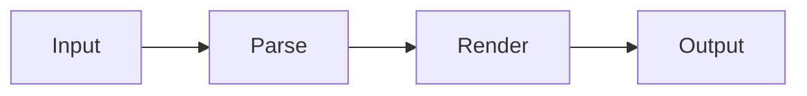

# Full Technical Document

## Abstract

This is a comprehensive technical document that tests all features of md-convert.

## 1. Introduction

This document demonstrates various markdown features.

## 2. Architecture

### 2.1 Components

| Component | Description | Status |
|-----------|-------------|--------|
| Parser | Markdown parsing | ✅ Active |
| Renderer | Output generation | ✅ Active |
| CLI | User interface | ✅ Active |

### 2.2 Code Example

```python
class Converter:
    """Main converter class."""

    def __init__(self, config):
        self.config = config

    def convert(self, input_path, output_path):
        """Convert markdown to output format."""
        content = read_file(input_path)
        html = self.parser.parse(content)
        self.renderer.render(html, output_path)
```

## 3. Diagrams

### Flow



## 4. Formulas

The quadratic formula is: $x = \frac{-b \pm \sqrt{b^2-4ac}}{2a}$

## 5. Conclusion

All features working as expected.
